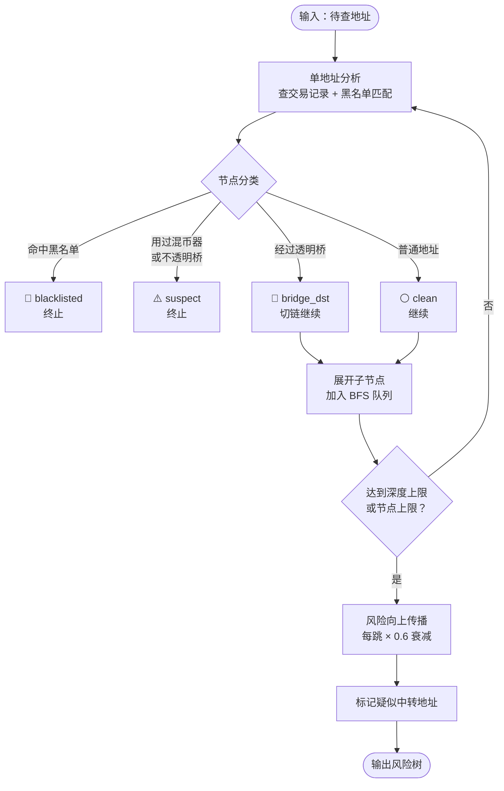
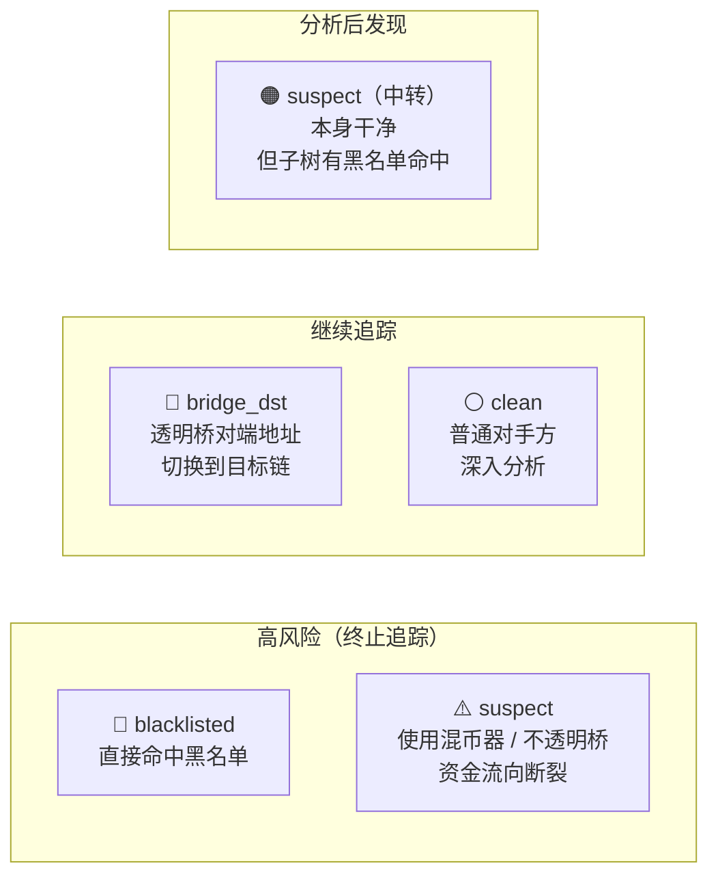
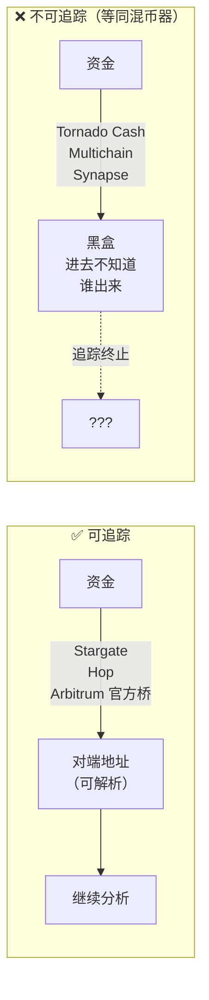
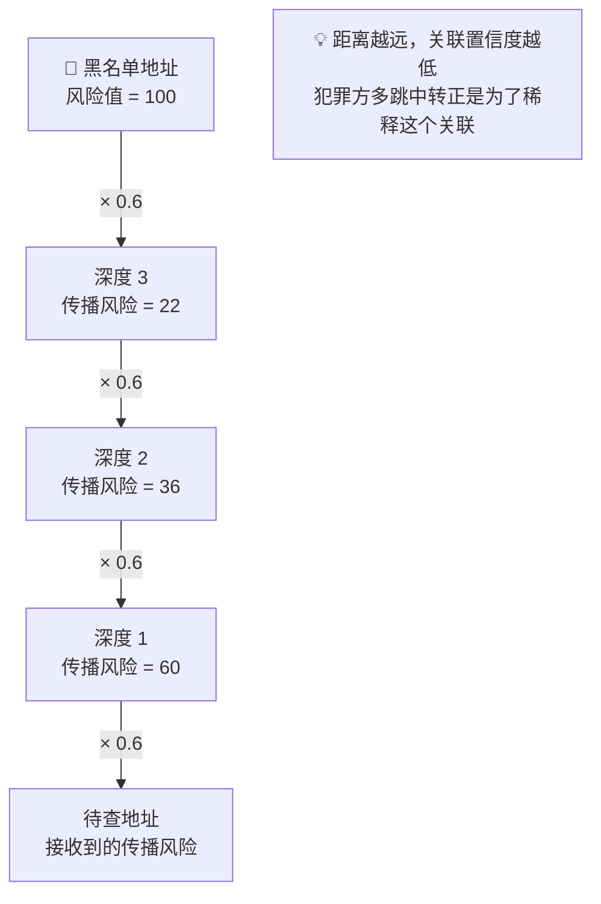

# 系统逻辑图

---

## 图 1：系统整体流程

```mermaid
flowchart TD
    A([输入：待查地址]) --> B[单地址分析\n查交易记录 + 黑名单匹配]
    B --> C{节点分类}

    C -->|"命中黑名单"| D[🔴 blacklisted\n终止]
    C -->|"用过混币器\n或不透明桥"| E[⚠️ suspect\n终止]
    C -->|"经过透明桥"| F[🔵 bridge_dst\n切链继续]
    C -->|"普通地址"| G[⚪ clean\n继续]

    F --> H[展开子节点\n加入 BFS 队列]
    G --> H

    H --> I{达到深度上限\n或节点上限？}
    I -->|否| B
    I -->|是| J[风险向上传播\n每跳 × 0.6 衰减]
    J --> K[标记疑似中转地址]
    K --> L([输出风险树])
```

---

## 图 2：五类地址与处理方式

```mermaid
flowchart LR
    subgraph HIGH["高风险（终止追踪）"]
        BL["🔴 blacklisted\n直接命中黑名单"]
        SUS["⚠️ suspect\n使用混币器 / 不透明桥\n资金流向断裂"]
    end

    subgraph CONTINUE["继续追踪"]
        BD["🔵 bridge_dst\n透明桥对端地址\n切换到目标链"]
        CL["⚪ clean\n普通对手方\n深入分析"]
    end

    subgraph DERIVED["分析后发现"]
        MU["🟠 suspect（中转）\n本身干净\n但子树有黑名单命中"]
    end
```

---

## 图 3：洗钱路径的可追溯性

```mermaid
flowchart LR
    subgraph TRACEABLE["✅ 可追踪"]
        A1["资金"] -->|"Stargate\nHop\nArbitrum 官方桥"| B1["对端地址\n（可解析）"]
        B1 --> C1["继续分析"]
    end

    subgraph UNTRACEABLE["❌ 不可追踪（等同混币器）"]
        A2["资金"] -->|"Tornado Cash\nMultichain\nSynapse"| B2["黑盒\n进去不知道\n谁出来"]
        B2 -. "追踪终止" .-> X2["???"]
    end
```

---

## 图 4：风险跳数衰减

```mermaid
flowchart TD
    BL["🔴 黑名单地址\n风险值 = 100"]
    D1["深度 1\n传播风险 = 60"]
    D2["深度 2\n传播风险 = 36"]
    D3["深度 3\n传播风险 = 22"]
    ROOT["待查地址\n接收到的传播风险"]

    BL -->|"× 0.6"| D3
    D3 -->|"× 0.6"| D2
    D2 -->|"× 0.6"| D1
    D1 -->|"× 0.6"| ROOT

    NOTE["💡 距离越远，关联置信度越低\n犯罪方多跳中转正是为了稀释这个关联"]
```
