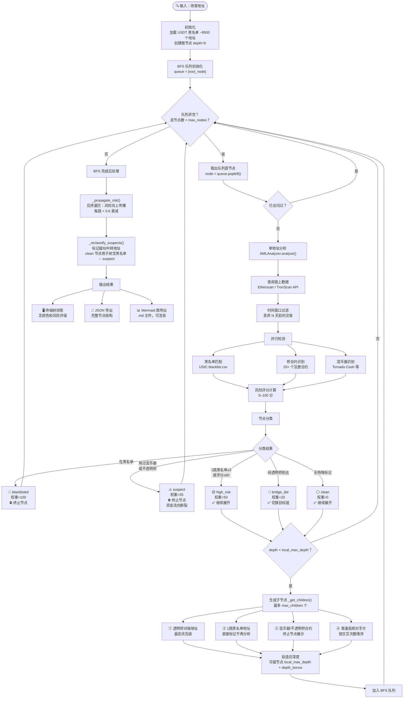
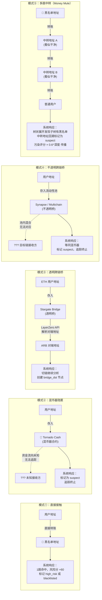
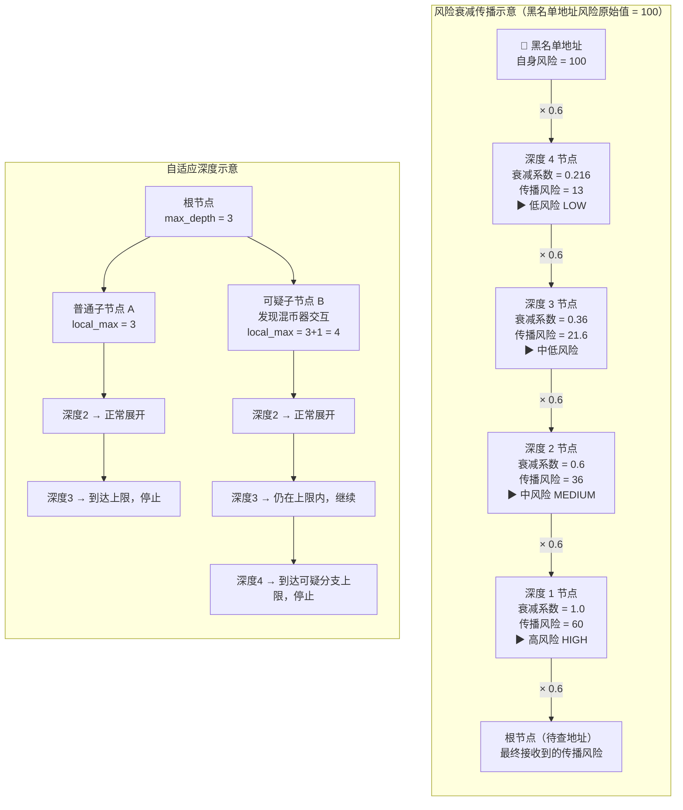
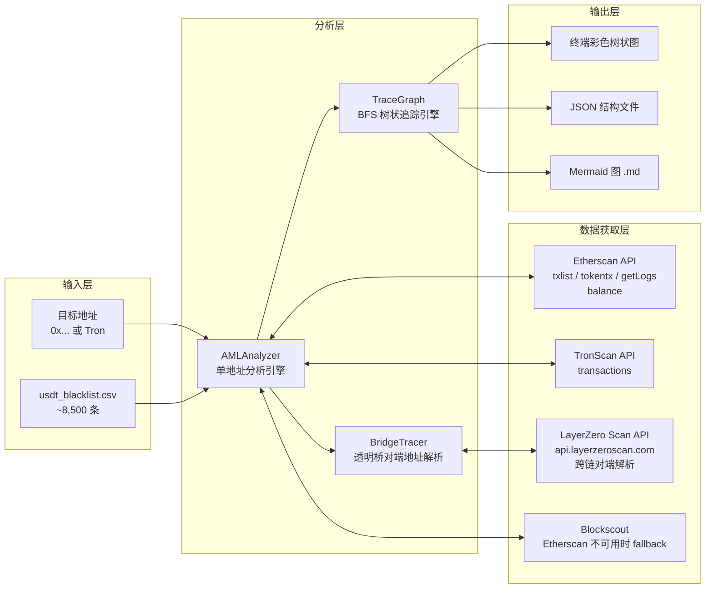

# 系统逻辑图集

---

## 图 1：系统整体流程



---

## 图 2：节点分类决策树

```mermaid
flowchart TD
    START(["分析一个地址"]) --> Q1

    Q1{"在 USDT 黑名单中？"}
    Q1 -- 是 --> BL["🔴 blacklisted\n直接被 Tether 冻结\n风险权重 = 100\n⛔ 终止，不再展开"]

    Q1 -- 否 --> Q2{"使用过混币器？\n或使用过不透明桥？"}
    Q2 -- 是 --> SUS["⚠️ suspect\n资金流向在此中断\n无法继续追踪\n风险权重 = 35\n⛔ 终止，不再展开"]

    Q2 -- 否 --> Q3{"1跳黑名单地址 ≥ 3 个\n或风险评分 ≥ 60？"}
    Q3 -- 是 --> HR["🟡 high_risk\n综合评分高\n风险权重 = 50\n✅ 继续展开子节点"]

    Q3 -- 否 --> Q4{"是否经由透明桥到达此节点？\n即 via_bridge != null"}
    Q4 -- 是 --> BD["🔵 bridge_dst\n透明桥对端地址\n已切换到目标链\n风险权重 = 20\n✅ 在目标链继续展开"]

    Q4 -- 否 --> CL["⚪ clean\n目前无已知风险\n风险权重 = 0\n✅ 继续展开子节点\n——但子树分析后可能升级为 suspect"]

    NOTE1["📌 注意：混币器合约本身\n（如 Tornado Cash 地址）\n在 _get_children 中被显式设为 mixer 节点\n与"使用了混币器的用户地址"是两个不同节点"]
    SUS -.-> NOTE1
```

---

## 图 3：五种洗钱路径及系统应对策略



---

## 图 4：风险评分与跳数衰减



---

## 图 5：数据流与 API 依赖


