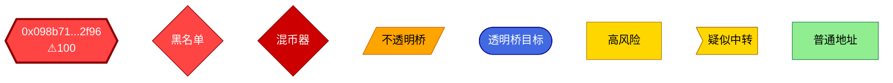

```mermaid
flowchart TD
    N1{{"0x098b71...2f96
⚠100"}}
    style N1 fill:#FF4444,stroke:#8b0000,color:#fff,stroke-width:3px

    %% 图例
    LEG_BL{"黑名单"}
    LEG_MX{"混币器"}
    LEG_OP[/"不透明桥"/]
    LEG_BD(["透明桥目标"])
    LEG_HR["高风险"]
    LEG_SP>"疑似中转"]
    LEG_CL["普通地址"]
    style LEG_BL fill:#FF4444,stroke:#8b0000,color:#fff
    style LEG_MX fill:#CC0000,stroke:#8b0000,color:#fff
    style LEG_OP fill:#FFA500,stroke:#cc6600,color:#000
    style LEG_BD fill:#4169E1,stroke:#00008b,color:#fff
    style LEG_HR fill:#FFD700,stroke:#b8860b,color:#000
    style LEG_SP fill:#FFD700,stroke:#b8860b,color:#000
    style LEG_CL fill:#90EE90,stroke:#2e8b57,color:#000
```
