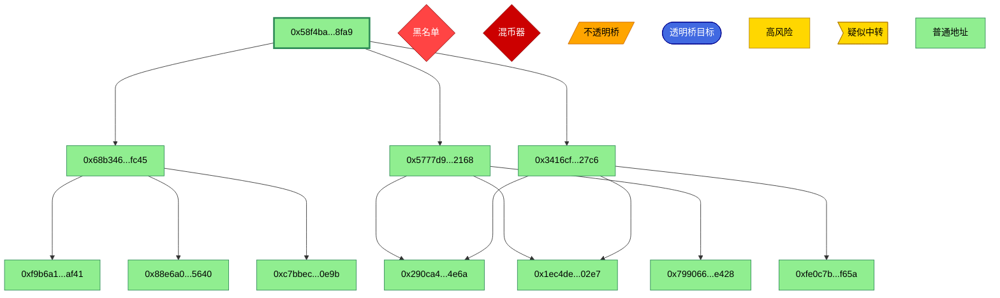

```mermaid
flowchart TD
    N1["0x58f4ba...8fa9"]
    N1["0x58f4ba...8fa9"] ----> N2["0x68b346...fc45"]
    N2["0x68b346...fc45"] ----> N3["0xf9b6a1...af41"]
    N2["0x68b346...fc45"] ----> N4["0x88e6a0...5640"]
    N2["0x68b346...fc45"] ----> N5["0xc7bbec...0e9b"]
    N1["0x58f4ba...8fa9"] ----> N6["0x5777d9...2168"]
    N6["0x5777d9...2168"] ----> N7["0x290ca4...4e6a"]
    N6["0x5777d9...2168"] ----> N8["0x1ec4de...02e7"]
    N6["0x5777d9...2168"] ----> N9["0x799066...e428"]
    N1["0x58f4ba...8fa9"] ----> N10["0x3416cf...27c6"]
    N10["0x3416cf...27c6"] ----> N7["0x290ca4...4e6a"]
    N10["0x3416cf...27c6"] ----> N8["0x1ec4de...02e7"]
    N10["0x3416cf...27c6"] ----> N11["0xfe0c7b...f65a"]
    style N1 fill:#90EE90,stroke:#2e8b57,color:#000,stroke-width:3px
    style N2 fill:#90EE90,stroke:#2e8b57,color:#000
    style N3 fill:#90EE90,stroke:#2e8b57,color:#000
    style N4 fill:#90EE90,stroke:#2e8b57,color:#000
    style N5 fill:#90EE90,stroke:#2e8b57,color:#000
    style N6 fill:#90EE90,stroke:#2e8b57,color:#000
    style N7 fill:#90EE90,stroke:#2e8b57,color:#000
    style N8 fill:#90EE90,stroke:#2e8b57,color:#000
    style N9 fill:#90EE90,stroke:#2e8b57,color:#000
    style N10 fill:#90EE90,stroke:#2e8b57,color:#000
    style N7 fill:#90EE90,stroke:#2e8b57,color:#000
    style N8 fill:#90EE90,stroke:#2e8b57,color:#000
    style N11 fill:#90EE90,stroke:#2e8b57,color:#000

    %% 图例
    LEG_BL{"黑名单"}
    LEG_MX{"混币器"}
    LEG_OP[/"不透明桥"/]
    LEG_BD(["透明桥目标"])
    LEG_HR["高风险"]
    LEG_SP>"疑似中转"]
    LEG_CL["普通地址"]
    style LEG_BL fill:#FF4444,stroke:#8b0000,color:#fff
    style LEG_MX fill:#CC0000,stroke:#8b0000,color:#fff
    style LEG_OP fill:#FFA500,stroke:#cc6600,color:#000
    style LEG_BD fill:#4169E1,stroke:#00008b,color:#fff
    style LEG_HR fill:#FFD700,stroke:#b8860b,color:#000
    style LEG_SP fill:#FFD700,stroke:#b8860b,color:#000
    style LEG_CL fill:#90EE90,stroke:#2e8b57,color:#000
```
